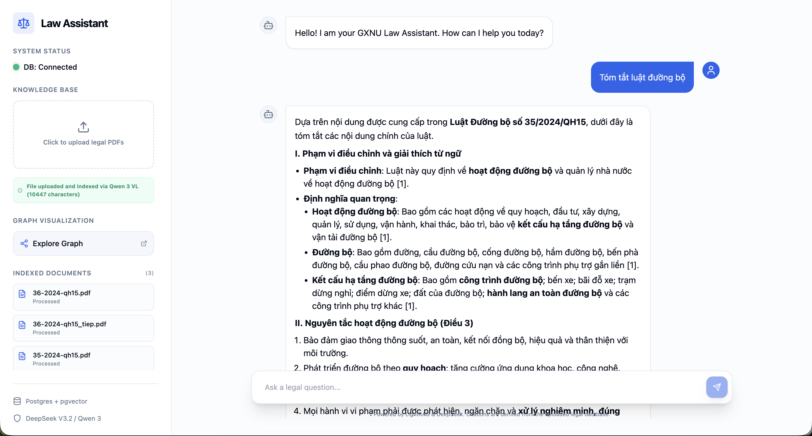
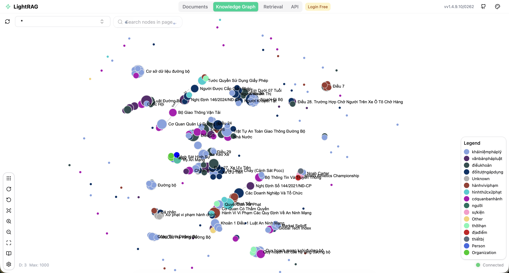
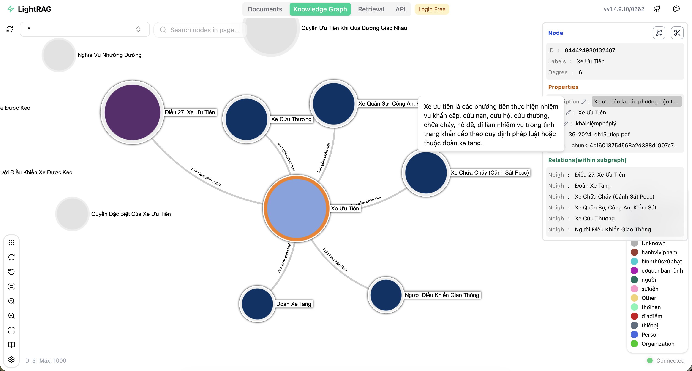
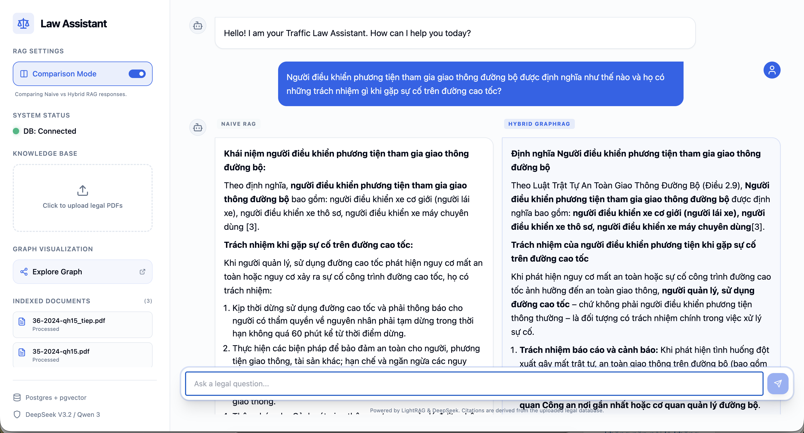
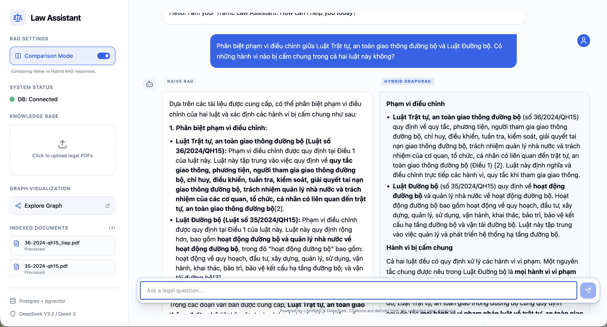
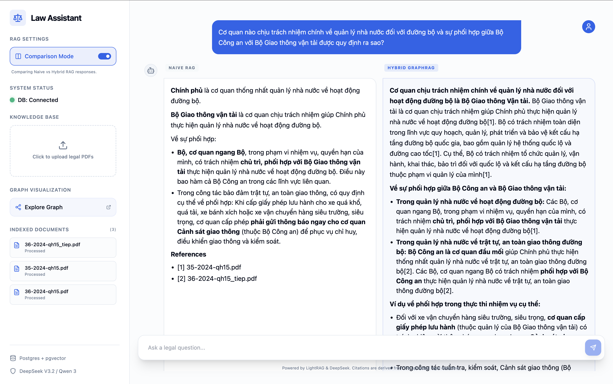
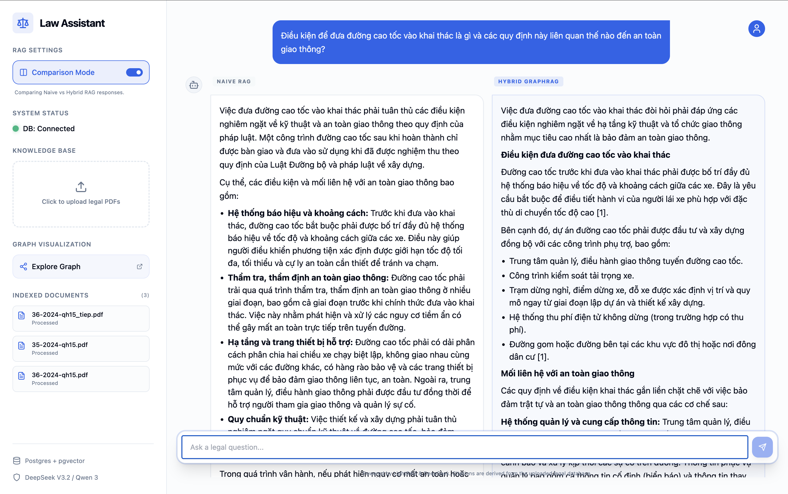
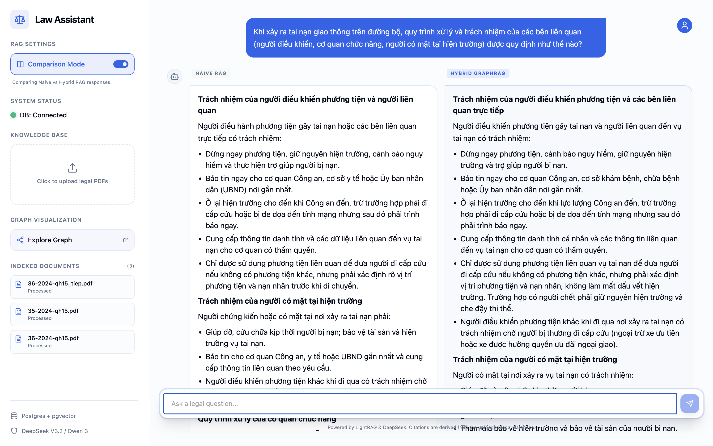

# Traffic Law Assistant (Legal RAG)



An advanced legal document assistant powered by **LightRAG**, localized for Vietnamese law and featuring high-fidelity Knowledge Graph visualization. This project uses **FastAPI** for the backend, **React** for the frontend, and **PostgreSQL (Apache AGE + pgvector)** for graph and vector storage.

## 🚀 Key Features

- **Vietnamese Legal Localization**: Specialized entity extraction for laws (_Điều khoản, Văn bản pháp luật, Cơ quan ban hành_).
- **Docling PDF Parsing Without OCR**: Uses **Docling** to extract embedded text from legal PDFs and saves extracted `.txt` artifacts for indexing. Scanned/image-only PDFs are rejected because OCR is disabled by design.
- **Interactive Knowledge Graph**: Explore legal relationships via the optional **LightRAG Graph UI** on port 8001.

  
  

- **Configurable Graph Builder**: A separate sidebar settings section lets you choose the global graph-build provider for future uploads.

- **Comparison Mode**: Side-by-side RAG evaluation with parallel streaming.

  
  
  
  
  

- **Hybrid RAG Retrieval**: Combined vector and graph search for precise legal grounding.
- **Modern Chat Interface**: Beautiful React UI with Markdown support and source citations.
- **Document Inventory**: Manage and track the status of all indexed legal documents.

## Hybrid Retrieval Mode

The comparison UI remains `naive vs hybrid`.

- `naive` is the exact-passage baseline.
- `hybrid` is tuned for traffic-law synthesis questions and now follows an anchor-first strategy:
  1. identify one central `Điều khoản`
  2. expand only into grounded scope, conditions, responsibilities, violations, and sanctions

Changing `ENTITY_TYPES` requires re-indexing the uploaded legal corpus.

## Graph Build Provider

The sidebar includes a dedicated `Graph Build Settings` section for the global graph-build provider.

- `ollama` keeps the local Ollama indexing path
- `9router` uses the OpenAI-compatible local proxy configured by `NINE_ROUTER_*`

The selected provider is stored in PostgreSQL and applies to all future uploads. Saving `9router` runs a backend validation check first, so the setting only changes when the proxy is reachable.

## 🛠 Tech Stack

- **Backend**: Python 3.11, FastAPI, `lightrag-hku`
- **Frontend**: Vite, React, TypeScript, Tailwind CSS, Shadcn UI
- **Database**: PostgreSQL with `pgvector` (Vector) and `Apache AGE` (Graph)
- **LLM/Embeddings**: Gemini Developer API for chat generation, Ollama or 9router local for LightRAG indexing, Docling for no-OCR PDF text extraction, plus local Vietnamese legal embeddings with `huyydangg/DEk21_hcmute_embedding`
- **Gemini response model**: `gemini-3.1-flash-lite` (default)
- **Deployment**: Docker Compose

## 📦 Getting Started

### Prerequisites

- Docker and Docker Compose
- Google Gemini API Key

### Environment Setup

Create a `.env` file in the root directory (refer to `.env.example`):

```bash
POSTGRES_USER=postgres
POSTGRES_PASSWORD=postgres
POSTGRES_DATABASE=law_assistant
GOOGLE_API_KEY=your_key_here
LLM_MODEL=gemini-3.1-flash-lite
EMBEDDING_BACKEND=sentence_transformers
EMBEDDING_MODEL=huyydangg/DEk21_hcmute_embedding
EMBEDDING_DIM=768
EMBEDDING_DEVICE=cuda
```

The full `SUMMARY_LANGUAGE`, `ENTITY_TYPES`, and Docker-specific overrides such as `DOCKER_EMBEDDING_DEVICE=cpu` live in `.env.example` and are mirrored in Docker Compose.

### Running the Application

Start the full app with Docker:

```bash
docker compose up --build
```

The application will be available at:

- **Main UI**: `http://localhost:3000`
- **Backend API**: `http://localhost:8000`
- **Graph Visualization**: `http://localhost:8001` when the optional `rag-ui` profile is started

### Run With Docker Logs

If you want the main UI and backend together while watching logs:

```bash
docker compose up --build frontend backend
```

In another terminal, follow logs:

```bash
docker compose logs -f frontend backend
```

If you want everything in the background:

```bash
docker compose up -d db backend frontend
docker compose logs -f frontend backend
```

If you want the optional LightRAG Web UI too, start it explicitly because it is behind the `rag-ui` profile:

```bash
docker compose --profile rag-ui up -d rag-ui
docker compose logs -f rag-ui
```

> [!IMPORTANT]
> The repository's default ingestion path is the main app on `http://localhost:3000`.
> It uses a local SentenceTransformer embedding model (`huyydangg/DEk21_hcmute_embedding`)
> inside the backend container. The optional `rag-ui` service is a separate
> `lightrag-server` process and cannot use that local model through
> `EMBEDDING_BINDING=openai` out of the box. This repository patches `rag-ui`
> at startup so its OpenAI-style embedding path is transparently backed by the
> same local SentenceTransformer model instead of a remote embedding API.

> [!IMPORTANT]
> If you intentionally override `RAG_UI_EMBEDDING_*` to a server-backed embedding
> backend later, remember that `rag-ui` and the main backend will no longer share
> the same embedding space unless you reconfigure both sides to match.

## 🧠 Architecture

The system consists of three main services:

- `db`: Custom Postgres image built from `db/Dockerfile` with vector and graph extensions.
- `backend`: Handles chat, PDF parsing, document indexing, and global graph-provider settings.
- `rag-ui`: Provides the optional Knowledge Graph visualization interface and is
  not the default indexing path for this repository.

## 🇻🇳 Localization Details

The RAG engine is optimized for Vietnamese:

- `SUMMARY_LANGUAGE`: Defaults to `Vietnamese` in `backend/config.py` and Docker Compose.
- `ENTITY_TYPES`: Full legal taxonomy is defined in `backend/config.py`, mirrored in `.env.example`, and must stay aligned with Docker Compose. Changing it requires re-indexing the uploaded legal corpus.

## 🌍 Embedding Setup

This repository now supports a local Hugging Face embedding backend for Vietnamese legal retrieval:

- **Primary legal embedding model**: **[huyydangg/DEk21_hcmute_embedding](https://huggingface.co/huyydangg/DEk21_hcmute_embedding)**
- **Embedding backend**: `sentence-transformers`
- **Vector dimension**: `768`
- **Device**: `cuda`
- **Query format**: instruction-style prefix via `EMBEDDING_QUERY_INSTRUCTION`

> [!NOTE]
> Switching from the previous embedding space to `huyydangg/DEk21_hcmute_embedding` (768D) requires a full reindex. Existing vector data must not be mixed across embedding spaces.

> [!IMPORTANT]
> Chat generation now uses the Gemini Developer API directly through `GOOGLE_API_KEY`. `OPENROUTER_API_KEY` is no longer needed for the normal chat flow.

> [!IMPORTANT]
> Docker now defaults embeddings to CPU via `DOCKER_EMBEDDING_DEVICE=cpu` for better stability on Windows Docker Desktop. Your root `.env` can still keep `EMBEDDING_DEVICE=cuda` for non-Docker runs.
