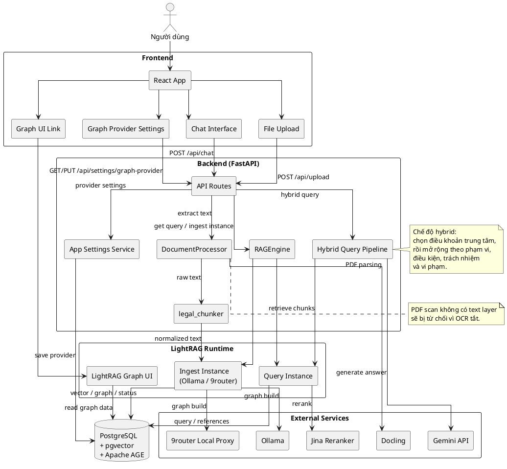
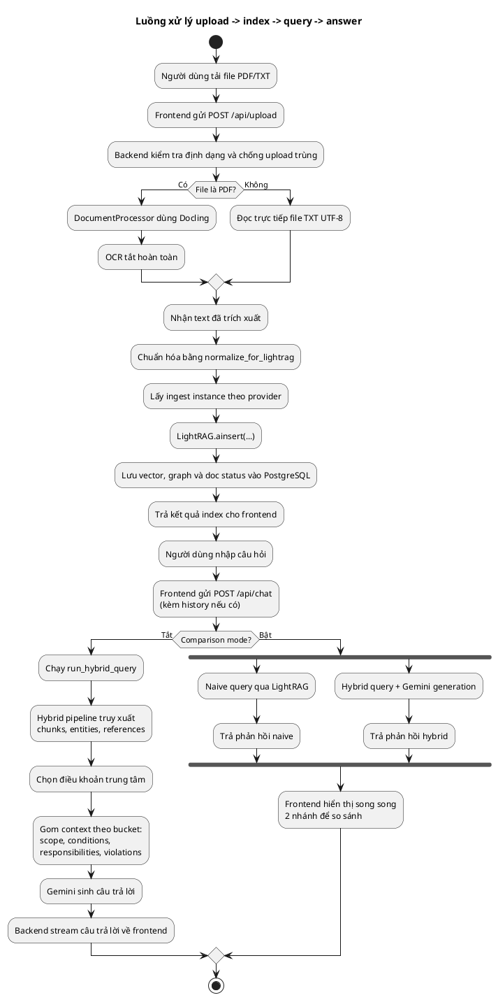

# Báo cáo tổng hợp dự án Legal-RAG

Dự án Legal-RAG xây dựng một trợ lý hỏi đáp pháp luật giao thông tiếng Việt theo hướng RAG lai. Hệ thống cho phép người dùng nạp văn bản pháp luật, chuẩn hóa nội dung, lập chỉ mục tri thức, truy vấn có trích dẫn nguồn và so sánh chất lượng giữa hai cách tiếp cận `naive` và `hybrid`.

## CHƯƠNG 2. PHÂN TÍCH YÊU CẦU CỦA BÀI TOÁN

### 2.1. Yêu cầu của bài toán

Bài toán đặt ra là hỗ trợ tra cứu và hỏi đáp trên các văn bản pháp luật giao thông đường bộ bằng tiếng Việt, trong đó câu trả lời phải bám sát điều khoản, có khả năng truy vết nguồn và xử lý được các câu hỏi cần tổng hợp nhiều quy định liên quan. Từ đặc trưng của miền pháp lý, hệ thống không chỉ cần tìm đúng đoạn văn bản mà còn phải hiểu được quan hệ giữa điều, khoản, chủ thể áp dụng, ngoại lệ, trách nhiệm và chế tài.

#### 2.1.1. Yêu cầu về xử lý tài liệu đầu vào

Hệ thống phải hỗ trợ ít nhất hai định dạng đầu vào phổ biến là PDF và TXT. Với PDF, nội dung cần được trích xuất thành văn bản để phục vụ lập chỉ mục; với TXT, hệ thống có thể đọc trực tiếp. Trong ngữ cảnh pháp luật, chất lượng trích xuất rất quan trọng vì chỉ cần mất một ký hiệu điều khoản hoặc một mốc trích dẫn là ý nghĩa pháp lý có thể thay đổi.

Project hiện tại dùng Docling để tách văn bản từ PDF và tắt OCR theo thiết kế. Điều này giúp loại bỏ một lớp xử lý phức tạp, đồng thời giữ cho pipeline ổn định hơn với các file có text layer rõ ràng. Những file scan chỉ có ảnh, không có lớp chữ, sẽ bị từ chối thay vì cố gắng suy diễn bằng OCR. Cách làm này phù hợp với mục tiêu ưu tiên độ chính xác và khả năng truy vết hơn là cố gắng xử lý mọi loại PDF.

#### 2.1.2. Yêu cầu chuẩn hóa văn bản pháp luật

Văn bản luật Việt Nam có cấu trúc phân cấp rõ: chương, mục, điều, khoản, điểm. Nếu đưa nguyên văn thô vào bộ RAG, mô hình dễ cắt sai biên giới điều luật hoặc mất ngữ cảnh của các tiêu đề lân cận. Vì vậy, hệ thống cần một bước chuẩn hóa trước khi lập chỉ mục.

Trong project, văn bản sau khi trích xuất được chuẩn hóa để LightRAG chia theo ranh giới `Điều` thay vì chia ngẫu nhiên theo token. Các tiêu đề `CHƯƠNG` và `MỤC` được làm sạch về dạng thống nhất, đồng thời một breadcrumb ngắn dạng `[Chương ... > Mục ...]` được gắn vào đầu mỗi khối điều luật. Cách chuẩn hóa này giúp câu trả lời sau truy vấn vẫn giữ được mạch văn bản và bối cảnh pháp lý cần thiết.

#### 2.1.3. Yêu cầu lập chỉ mục và lưu trữ tri thức

Hệ thống cần chuyển đổi tài liệu luật thành tri thức có thể tìm kiếm hiệu quả, bao gồm vector, đồ thị và trạng thái tài liệu. Dữ liệu phải được lưu bền vững để không phải lập chỉ mục lại mỗi lần khởi động, đồng thời phải hỗ trợ theo dõi trạng thái từng file đã nạp.

Legal-RAG dùng LightRAG làm lõi lập chỉ mục, PostgreSQL làm lớp lưu trữ, `pgvector` cho truy hồi vector và Apache AGE cho lưu trữ đồ thị tri thức. Ngoài ra, trạng thái xử lý tài liệu được lưu riêng để tránh nạp trùng hoặc chồng trạng thái giữa các lần upload. Việc chọn provider để build graph cũng được tách khỏi luồng hỏi đáp và lưu trong cơ sở dữ liệu để áp dụng cho những file upload sau.

#### 2.1.4. Yêu cầu hỏi đáp, truy xuất thông tin và trích dẫn nguồn

Người dùng không chỉ muốn “tìm đoạn giống nhất” mà còn muốn có một câu trả lời pháp lý đầy đủ, có thể chỉ ra điều khoản trung tâm, các điều khoản bổ trợ và nguồn gốc của thông tin. Do đó hệ thống phải hỗ trợ truy xuất có ngữ cảnh, trả lời bằng tiếng Việt, và giữ traceability từ câu trả lời về tài liệu gốc.

Project hiện có hai chế độ so sánh: `naive` và `hybrid`. `Naive` đóng vai trò baseline để kiểm tra truy hồi exact passage, còn `hybrid` được thiết kế cho câu hỏi cần tổng hợp, nối nhiều quy định liên quan. Frontend còn truyền lịch sử hội thoại gần nhất để backend có thể dùng cho cả truy xuất và sinh câu trả lời, đặc biệt hữu ích với các câu hỏi follow-up. Bên cạnh đó, hệ thống đã chuẩn bị các thành phần hiển thị nguồn tham chiếu trong giao diện.

#### 2.1.5. Yêu cầu giao diện người dùng

Giao diện cần đủ trực quan để người dùng không chuyên công nghệ vẫn có thể tải tài liệu, quan sát trạng thái hệ thống và đặt câu hỏi. Đồng thời, UI phải hỗ trợ đánh giá chất lượng trả lời bằng cách đặt hai phương án cạnh nhau.

Ứng dụng frontend hiện thực yêu cầu này bằng React. Thanh bên cung cấp công tắc `Comparison Mode`, khu vực cấu hình `Graph Build Settings`, upload tài liệu, liên kết mở đồ thị tri thức và danh sách tài liệu đã index. Khung chat chính hỗ trợ Markdown, streaming, và hiển thị song song `Naive RAG` và `Hybrid GraphRAG` khi cần so sánh.

#### 2.1.6. Yêu cầu phi chức năng

Ngoài chức năng chính, hệ thống còn phải đáp ứng các yêu cầu phi chức năng sau:

- Tính chính xác: câu trả lời phải bám vào điều khoản và tránh suy diễn ngoài ngữ cảnh.
- Tính truy vết: mỗi câu trả lời cần có thể quy ngược về tài liệu gốc.
- Tính ổn định: hệ thống phải xử lý được lỗi mạng, thiếu API key hoặc provider không sẵn sàng.
- Tính mở rộng: có thể thay đổi provider lập chỉ mục, embedding hoặc mô hình sinh câu trả lời qua biến môi trường.
- Tính triển khai: chạy được bằng Docker Compose với cấu hình tương đối độc lập.
- Tính phản hồi: hỗ trợ streaming để người dùng thấy kết quả dần thay vì chờ toàn bộ câu trả lời.

### 2.2. Các phương pháp giải quyết bài toán

Có nhiều cách tiếp cận bài toán hỏi đáp pháp luật:

- Tìm kiếm từ khóa thuần túy: dễ triển khai nhưng thường chỉ trả về đoạn khớp bề mặt, không giải quyết được các câu hỏi cần tổng hợp nhiều điều khoản.
- RAG vector thuần túy: tốt hơn tìm kiếm từ khóa vì hiểu ngữ nghĩa, nhưng trong văn bản luật vẫn dễ bỏ sót điều khoản trung tâm hoặc các ngoại lệ quan trọng.
- GraphRAG: tận dụng quan hệ giữa các thực thể pháp lý, phù hợp với luật vì các quy định thường liên kết theo chủ thể, điều kiện, ngoại lệ và chế tài.
- Hệ chuyên gia luật hóa cứng: có thể rất chính xác trong phạm vi hẹp nhưng khó mở rộng, khó bảo trì và không phù hợp với lượng văn bản lớn, biến động theo bộ luật.

Trong bối cảnh Legal-RAG, phương án phù hợp nhất là kết hợp vector search với đồ thị tri thức, đồng thời vẫn giữ một baseline naive để kiểm tra khả năng truy hồi nguyên văn. Cách tiếp cận lai cho phép tận dụng ưu thế của từng phương pháp: vector giúp tìm đúng vùng liên quan, đồ thị giúp nối các thực thể và điều khoản, còn mô hình ngôn ngữ lớn giúp diễn giải kết quả thành câu trả lời tự nhiên.

### 2.3. Lựa chọn hướng tiếp cận cho bài toán

Project lựa chọn hướng tiếp cận `LightRAG + đồ thị tri thức + prompt có kiểm soát + embedding cục bộ + so sánh naive/hybrid`. Lý do chính là:

1. Văn bản pháp luật có cấu trúc rõ, nên có thể chuẩn hóa và chunk theo điều khoản.
2. Nhiều câu hỏi giao thông đòi hỏi nối nhiều quy định liên quan thay vì chỉ tìm một đoạn giống nhất.
3. Người dùng cần câu trả lời có nguồn gốc rõ ràng, không chỉ một đoạn văn mô phỏng.
4. Việc so sánh `naive` và `hybrid` giúp đánh giá trực tiếp giá trị của cách tiếp cận đồ thị lai.

Nhờ đó, hệ thống không đi theo hướng xây dựng một bộ luật suy diễn cứng mà tập trung vào pipeline RAG có kiểm soát: trích xuất văn bản tốt, chuẩn hóa tốt, lập chỉ mục tốt, truy xuất có anchor rõ ràng và trả lời dựa trên ngữ cảnh đã truy xuất.

## CHƯƠNG 3. PHƯƠNG PHÁP ĐỀ XUẤT

### 3.1. Tổng quan phương pháp

Phương pháp đề xuất tổ chức hệ thống thành một luồng khép kín gồm bốn pha chính:

1. Nạp tài liệu: người dùng tải lên PDF hoặc TXT.
2. Tiền xử lý và lập chỉ mục: trích xuất văn bản, chuẩn hóa luật, chia đoạn và đưa vào LightRAG.
3. Truy vấn: người dùng đặt câu hỏi, hệ thống truy xuất theo chế độ `naive` hoặc `hybrid`.
4. Sinh câu trả lời: mô hình ngôn ngữ lớn diễn giải ngữ cảnh đã truy xuất thành câu trả lời tiếng Việt có trật tự, có anchor điều khoản trung tâm và các phần bổ trợ.

Điểm khác biệt chính của phương pháp này là `hybrid` không chỉ gom các đoạn gần nghĩa, mà còn chủ động chọn một `Điều khoản` trung tâm làm trục trả lời, sau đó mở rộng sang phạm vi áp dụng, điều kiện, trách nhiệm và vi phạm. Nhờ vậy, câu trả lời có “xương sống” pháp lý rõ hơn.

### 3.2. Kiến trúc hệ thống

#### 3.2.0. Sơ đồ kiến trúc hệ thống (PlantUML)

#### 3.2.1. Thành phần giao diện người dùng

Frontend được xây dựng bằng React, Vite, TypeScript và Tailwind. Màn hình chính chia thành hai phần: sidebar chức năng và vùng chat. Sidebar cho phép người dùng bật/tắt `Comparison Mode`, xem trạng thái kết nối DB, thay đổi graph provider, tải tài liệu mới, mở giao diện đồ thị và xem danh sách tài liệu đã index.

Trong vùng chat, người dùng nhập câu hỏi pháp lý và nhận phản hồi dạng Markdown. Khi bật comparison mode, giao diện hiển thị song song hai cột `Naive RAG` và `Hybrid GraphRAG`, giúp nhìn ra ngay sự khác biệt về mức độ bám luật, độ đầy đủ và tính mạch lạc.

#### 3.2.2. Thành phần API backend

Backend dùng FastAPI để cung cấp các endpoint chính:

- `POST /api/chat`: hỏi đáp thường hoặc so sánh naive/hybrid.
- `POST /api/upload`: upload và lập chỉ mục tài liệu.
- `GET /api/documents`: trả danh sách tài liệu đã nạp và trạng thái của chúng.
- `GET/PUT /api/settings/graph-provider`: đọc và cập nhật provider dùng cho graph build.
- `GET /api/settings/graph-provider/options`: lấy danh sách provider hợp lệ.
- `GET /api/health`: kiểm tra tình trạng backend.

Luồng chat hỗ trợ streaming qua SSE để giao diện nhận dữ liệu theo từng chunk. Khi comparison mode được bật, backend chạy hai nhánh song song: một nhánh naive và một nhánh hybrid. Đây là cơ sở để người dùng và người phát triển đánh giá chất lượng truy xuất theo cùng một câu hỏi đầu vào.

#### 3.2.3. Thành phần xử lý tài liệu

Thành phần `DocumentProcessor` là lớp đầu tiên chạm vào file upload. Nếu file là TXT, hệ thống đọc trực tiếp theo UTF-8. Nếu file là PDF, Docling được dùng để chuyển đổi sang văn bản với OCR tắt hoàn toàn. Văn bản trích xuất thành công sẽ được lưu ra một file `.txt` trong thư mục `extracted_txt` để phục vụ kiểm tra và tái sử dụng.

Nếu PDF không có text layer, quá trình xử lý sẽ dừng bằng lỗi rõ ràng thay vì cố OCR. Điều này làm cho hành vi ingest nhất quán và tránh index những tài liệu scan không đủ chất lượng.

#### 3.2.4. Thành phần chuẩn hóa văn bản pháp luật

Module `legal_chunker` chịu trách nhiệm chuẩn hóa văn bản trước khi đưa vào LightRAG. Nó tìm các mốc `Điều`, tách tài liệu theo ranh giới điều luật, thêm breadcrumb từ `Chương` và `Mục`, và làm phẳng các ngắt dòng không cần thiết ở bên trong điều.

Mục tiêu của bước này là để LightRAG chunk đúng nơi pháp lý quan trọng nhất, tức là biên điều khoản, thay vì cắt ngẫu nhiên giữa chừng một khoản hay một gạch đầu dòng. Đây là bước nền quan trọng để truy xuất đúng và trích dẫn chính xác.

#### 3.2.5. Thành phần phân đoạn văn bản và lập chỉ mục

Sau khi chuẩn hóa, nội dung được đưa vào LightRAG bằng `rag.ainsert(...)` với `split_by_character="\n\n"`. Tức là hệ thống đã chủ động tạo ra các ranh giới hợp lý để engine chia theo điều khoản thay vì phụ thuộc hoàn toàn vào chunking mặc định.

Chỉ mục được lưu qua các backend của LightRAG trên PostgreSQL, bao gồm vector storage, graph storage, key-value storage và doc status storage. Nhờ vậy, cùng một corpus có thể phục vụ truy vấn vector, truy vấn đồ thị và quản lý trạng thái tài liệu.

#### 3.2.6. Thành phần RAG Engine

`RAGEngine` là lớp trung tâm tạo và quản lý các instance LightRAG. Nó thực hiện ba nhiệm vụ chính:

- Thiết lập môi trường PostgreSQL cho LightRAG.
- Khởi tạo instance truy vấn dùng cho chat.
- Khởi tạo các instance lập chỉ mục theo provider `ollama` hoặc `9router`.

Query instance được warm lên khi backend khởi động, còn ingest instance được tạo lazily theo provider khi có upload mới. Cách thiết kế này giúp giảm chi phí khởi tạo và cho phép chọn provider theo từng đợt index mà không ảnh hưởng đến luồng hỏi đáp đang chạy.

#### 3.2.7. Thành phần embedding

Hệ thống dùng embedding cục bộ dựa trên Sentence Transformers với mô hình `huyydangg/DEk21_hcmute_embedding`, vector 768 chiều. Câu hỏi truy vấn được thêm instruction prefix để phù hợp với cách mô hình embedding này phân biệt query và passage.

Việc dùng embedding cục bộ giúp giảm phụ thuộc vào dịch vụ bên ngoài khi tra cứu pháp luật, đồng thời phù hợp với bài toán tiếng Việt hơn so với các mô hình tổng quát không chuyên cho miền pháp lý.

#### 3.2.8. Thành phần đồ thị tri thức

Đồ thị tri thức là phần cốt lõi làm nên giá trị của `hybrid`. Project dùng Apache AGE trong PostgreSQL để lưu graph, và ontology được mở rộng cho bài toán giao thông đường bộ với các kiểu thực thể như:

- `Văn bản pháp luật`
- `Điều khoản`
- `Cơ quan ban hành`
- `Đối tượng áp dụng`
- `Phạm vi áp dụng`
- `Trách nhiệm`
- `Ngoại lệ`
- `Điều kiện áp dụng`
- `Phương tiện giao thông`
- `Người tham gia giao thông`
- `Hành vi bị cấm`
- `Hình thức xử phạt`
- `Hành vi vi phạm`

Graph provider để build đồ thị được tách thành cấu hình riêng và lưu trong cơ sở dữ liệu. Người dùng có thể chọn `ollama` hoặc `9router` cho các lần upload tiếp theo. Nếu chọn `9router`, hệ thống kiểm tra kết nối trước khi ghi nhận cấu hình mới để tránh lưu một provider không hoạt động.

#### 3.2.9. Thành phần mô hình ngôn ngữ lớn

Mô hình ngôn ngữ lớn được dùng ở hai chỗ khác nhau:

- Sinh câu trả lời cuối cho người dùng.
- Sinh nội dung trích xuất có cấu trúc trong quá trình build graph.

Ở pha hỏi đáp, hệ thống dùng Gemini qua SDK chính thức của Google và giới hạn số token đầu ra bằng cấu hình. Ở pha lập chỉ mục, hệ thống vẫn hỗ trợ các provider như Ollama hoặc 9router để sinh đầu ra extraction theo prompt chặt chẽ. Ngoài ra, Jina rerank được dùng khi bật được cấu hình rerank để tăng chất lượng chọn ngữ cảnh trong `hybrid`.

#### 3.2.10. Thành phần lưu trữ và triển khai

Project triển khai bằng Docker Compose với các service chính:

- `db`: PostgreSQL tùy biến cho `pgvector` và Apache AGE.
- `backend`: FastAPI, xử lý upload, chat, indexing và cài đặt provider.
- `frontend`: giao diện React.
- `rag-ui`: giao diện đồ thị tri thức LightRAG, chạy ở profile riêng.

Các service được gắn vào cùng một môi trường cấu hình qua biến môi trường, giúp hệ thống có thể chạy cục bộ trên máy phát triển hoặc trong môi trường Docker Desktop mà không cần sửa logic ứng dụng.

### 3.3. Quy trình hoạt động của hệ thống

#### 3.3.1. Sơ đồ luồng xử lý (PlantUML)

Quy trình hoạt động có thể mô tả theo chuỗi sau:

1. Khi khởi động backend, hệ thống khởi tạo phần cài đặt graph provider và warm instance truy vấn của RAG engine.
2. Người dùng upload PDF hoặc TXT qua giao diện.
3. Backend lưu file tạm, kiểm tra trùng lặp, trích xuất text, chuẩn hóa văn bản pháp luật và đưa vào LightRAG.
4. Nội dung được lập chỉ mục vào vector store và graph store, đồng thời trạng thái tài liệu được cập nhật.
5. Khi người dùng đặt câu hỏi, frontend gửi kèm nội dung câu hỏi và lịch sử hội thoại gần nhất.
6. Backend chạy truy vấn `naive` hoặc `hybrid` tùy chế độ.
7. Với `hybrid`, hệ thống lấy intent, chọn điều khoản trung tâm, gom các chunk bổ trợ theo nhóm ngữ nghĩa rồi dựng system prompt có cấu trúc.
8. Gemini sinh câu trả lời tiếng Việt dựa trên ngữ cảnh đã ghép, và backend stream kết quả về frontend.
9. Khi bật comparison mode, cả hai nhánh `naive` và `hybrid` được chạy song song để người dùng đối chiếu.

### 3.4. Ưu điểm của phương pháp đề xuất

Phương pháp đề xuất có một số ưu điểm rõ rệt:

- Bám sát đặc thù văn bản pháp luật Việt Nam nhờ chuẩn hóa theo chương, mục, điều.
- Giữ được anchor pháp lý trung tâm thay vì trả lời theo kiểu “đoạn nào gần nhất”.
- Kết hợp vector search và graph reasoning để xử lý cả câu hỏi tra cứu và câu hỏi tổng hợp.
- Dễ truy vết nguồn nhờ gắn nhãn tham chiếu từ tài liệu gốc vào ngữ cảnh truy vấn.
- Có chế độ comparison mode để đánh giá chất lượng theo cùng một câu hỏi.
- Triển khai được theo hướng mô-đun hóa, có thể thay đổi embedding, provider build graph hoặc model sinh câu trả lời qua cấu hình.

### 3.5. Hạn chế của phương pháp đề xuất

Dù phù hợp với bài toán hiện tại, phương pháp vẫn có các giới hạn:

- Chỉ hoạt động tốt với PDF có text layer; file scan không được hỗ trợ do OCR bị tắt.
- Chất lượng trả lời phụ thuộc mạnh vào chất lượng trích xuất và ontology đồ thị.
- Một số câu hỏi quá mơ hồ hoặc thiếu điều khoản neo sẽ bị trả về trạng thái “không đủ ngữ cảnh”.
- Khi thay đổi ontology `ENTITY_TYPES`, cần lập chỉ mục lại toàn bộ corpus.
- Hệ thống vẫn phụ thuộc vào một số dịch vụ bên ngoài như Gemini, Jina hoặc provider lập chỉ mục.
- Chưa có bộ đánh giá tự động đủ lớn để đo chính xác bằng các chỉ số định lượng toàn diện.

## CHƯƠNG 4. THỰC NGHIỆM

### 4.1. Mục tiêu thực nghiệm

Thực nghiệm nhằm kiểm tra bốn nội dung chính:

1. Hệ thống có nạp và chuẩn hóa tài liệu pháp luật đúng cách hay không.
2. `Hybrid` có cải thiện khả năng truy xuất và tổng hợp so với `naive` hay không.
3. Câu trả lời có bám điều khoản trung tâm và giữ được ngữ cảnh pháp lý hay không.
4. Hệ thống có đáp ứng tốt về thời gian phản hồi và trải nghiệm người dùng hay không.

### 4.2. Môi trường thực nghiệm

Môi trường thực nghiệm là cấu hình Docker Compose của project, trong đó:

- Backend chạy bằng Python 3.11 và FastAPI.
- Frontend chạy bằng React/Vite/TypeScript.
- PostgreSQL được mở rộng bằng `pgvector` và Apache AGE.
- LightRAG chạy như lõi truy xuất tri thức.
- Docling dùng cho trích xuất PDF.
- Gemini dùng cho sinh câu trả lời.
- Jina rerank và provider `ollama`/`9router` dùng cho các pha phụ thuộc ngữ cảnh và lập chỉ mục.

Các service chính được expose theo các cổng quen thuộc: frontend ở `3000`, backend ở `8000`, giao diện đồ thị ở `8001`, còn PostgreSQL được map ra cổng riêng để phục vụ môi trường local.

### 4.3. Dữ liệu thực nghiệm

Dữ liệu thực nghiệm lấy từ bộ văn bản luật giao thông đường bộ trong thư mục `data`, đặc biệt là hai văn bản chính:

- `35-2024-QH15.pdf`
- `36-2024-QH15.pdf`
- `36-2024-QH15_tiep.pdf`

Đây là các văn bản có cấu trúc điều khoản rõ ràng, phù hợp để kiểm tra khả năng tách điều, truy xuất theo phạm vi áp dụng, trách nhiệm, ngoại lệ và chế tài. Ngoài dữ liệu gốc, project còn có các kịch bản câu hỏi đánh giá chuyên biệt tập trung vào những tình huống cần nối nhiều quy định giữa hai bộ luật.

### 4.4. Quy trình xử lý dữ liệu

Quy trình xử lý dữ liệu trong thực nghiệm diễn ra như sau:

1. Nạp file PDF/TXT vào giao diện upload.
2. Backend xác nhận định dạng hợp lệ và lưu file tạm.
3. DocumentProcessor trích xuất nội dung từ PDF bằng Docling hoặc đọc TXT trực tiếp.
4. Nội dung được chuẩn hóa bởi `normalize_for_lightrag`.
5. Dữ liệu sau chuẩn hóa được đưa vào LightRAG với ranh giới tách theo `\n\n`.
6. Cơ sở dữ liệu ghi nhận trạng thái tài liệu để tránh index trùng.
7. File tạm được xóa sau khi hoàn tất.

Nếu tài liệu không có nội dung trích xuất được, hệ thống trả về lỗi rõ ràng thay vì tạo chỉ mục rỗng. Cách này giúp kết quả thực nghiệm phản ánh đúng chất lượng pipeline chứ không che giấu lỗi bằng dữ liệu giả.

### 4.5. Công nghệ sử dụng

Những công nghệ chính được dùng trong thực nghiệm gồm:

- `FastAPI` cho backend API.
- `React`, `TypeScript`, `Vite`, `Tailwind CSS` cho frontend.
- `LightRAG` làm engine RAG.
- `PostgreSQL`, `pgvector`, `Apache AGE` cho lưu trữ vector và đồ thị.
- `Docling` cho trích xuất PDF không OCR.
- `Sentence Transformers` với mô hình embedding tiếng Việt.
- `Gemini` cho sinh câu trả lời.
- `Jina Reranker` cho rerank ngữ cảnh khi có cấu hình.
- `Ollama` và `9router` cho các luồng lập chỉ mục.
- `Docker Compose` cho triển khai đồng bộ.

### 4.6. Kịch bản thực nghiệm

Các kịch bản thực nghiệm được thiết kế để bộc lộ khác biệt giữa truy hồi “đoạn giống nhất” và truy hồi “điều khoản trung tâm + ngữ cảnh bổ trợ”. Một số nhóm câu hỏi tiêu biểu gồm:

- Phạm vi áp dụng và đối tượng điều chỉnh.
- Điều kiện, ngoại lệ và tình huống đặc biệt.
- Trách nhiệm của người tham gia giao thông hoặc cơ quan quản lý.
- Hành vi bị cấm và chế tài liên quan.
- Câu hỏi yêu cầu liên kết nhiều điều khoản trong cùng một đạo luật hoặc giữa hai đạo luật.

Ngoài ra, bộ câu hỏi thử nghiệm còn có những câu hỏi mẫu như:

- “Đối tượng nào được phép hoặc không được phép sử dụng xe cứu hộ giao thông đường bộ?”
- “Ai chịu trách nhiệm quản lý nhà nước về hoạt động đường bộ và trách nhiệm đó được phân chia như thế nào?”
- “Những hành vi nào bị cấm và có thể dẫn đến xử phạt trong hoạt động đường bộ?”

### 4.7. Phương pháp đánh giá

Việc đánh giá được thực hiện theo hướng so sánh định tính giữa `naive` và `hybrid` trên cùng một tập câu hỏi. Các tiêu chí chính gồm:

- Độ đúng của điều khoản trung tâm được chọn.
- Mức độ đầy đủ của phần giải thích bổ trợ.
- Khả năng giữ nguyên ý nghĩa pháp lý của điều khoản.
- Mức độ trích dẫn và truy vết được về tài liệu gốc.
- Thời gian phản hồi và cảm nhận mượt mà nhờ streaming.

Nếu `naive` trả về đoạn đúng nhưng rời rạc, còn `hybrid` có thể nêu rõ điều luật trung tâm, phần áp dụng, ngoại lệ và trách nhiệm liên quan, thì `hybrid` được xem là phù hợp hơn với bài toán pháp lý. Ngược lại, với các câu hỏi tra cứu đúng số điều, `naive` vẫn là baseline hữu ích để kiểm tra độ chính xác nguyên văn.

### 4.8. Kết quả thực nghiệm

#### 4.8.1. Kết quả xử lý và lập chỉ mục tài liệu

Kết quả xử lý tài liệu cho thấy pipeline upload có thể trích xuất văn bản, chuẩn hóa theo cấu trúc luật và lập chỉ mục thành công. Tài liệu sau khi nạp được hiển thị trong danh sách tài liệu đã index, cùng với trạng thái xử lý tương ứng. Việc chia theo điều khoản và gắn breadcrumb giúp nội dung lập chỉ mục có bối cảnh tốt hơn so với văn bản thô.

#### 4.8.2. Kết quả truy xuất thông tin

Trong các câu hỏi truy xuất đúng điều khoản cụ thể, `naive` thường có lợi thế vì đi gần tới đoạn nguyên văn. Tuy nhiên, với các câu hỏi cần tổng hợp nhiều yếu tố pháp lý như phạm vi, ngoại lệ, trách nhiệm hay chế tài, `hybrid` cho kết quả có cấu trúc hơn vì nó chọn một điều khoản trung tâm rồi mở rộng theo các nhóm ngữ nghĩa liên quan.

Điểm quan trọng là `hybrid` không chỉ gom nhiều đoạn có từ khóa giống nhau mà còn cố gắng giữ một “xương sống” truy vấn. Điều này giúp giảm hiện tượng trả lời chung chung hoặc lan sang các điều khoản không thật sự phục vụ câu hỏi.

#### 4.8.3. Kết quả hỏi đáp của hệ thống

Kết quả hỏi đáp cho thấy hệ thống có thể trả lời bằng tiếng Việt tự nhiên, có cấu trúc rõ ràng và phù hợp với ngữ cảnh pháp luật giao thông. Khi câu hỏi đủ cụ thể, câu trả lời thường bắt đầu bằng điều khoản trung tâm rồi mới giải thích các phần liên quan. Khi câu hỏi thiếu neo rõ ràng, hệ thống có xu hướng báo rằng chưa đủ ngữ cảnh thay vì tự suy diễn.

Chế độ comparison mode đặc biệt hữu ích vì cho phép nhìn trực tiếp sự khác biệt giữa hai phong cách trả lời: `naive` ngắn gọn, bám đoạn; `hybrid` mạch lạc hơn, có xu hướng đưa ra câu trả lời pháp lý đầy đủ hơn trong các tình huống cần tổng hợp.

#### 4.8.4. Kết quả hiệu năng phản hồi

Về trải nghiệm phản hồi, việc dùng streaming giúp người dùng thấy câu trả lời xuất hiện dần thay vì chờ toàn bộ kết quả. Query instance được warm từ lúc khởi động backend cũng giúp giảm độ trễ ở lượt hỏi đầu tiên. Ngoài ra, việc tách ingest provider khỏi query provider giúp quá trình lập chỉ mục không làm ảnh hưởng trực tiếp tới chất lượng phản hồi khi tra cứu.

Hiệu năng tổng thể vẫn phụ thuộc vào các dịch vụ bên ngoài như Gemini, Jina hoặc provider lập chỉ mục. Tuy nhiên, trong phạm vi kiến trúc hiện tại, pipeline đã cân bằng được giữa độ chính xác pháp lý, khả năng mở rộng và trải nghiệm người dùng.

### 4.9. Nhận xét và đánh giá

Legal-RAG đáp ứng đúng mục tiêu của một trợ lý pháp lý cho lĩnh vực giao thông đường bộ: nạp tài liệu, chuẩn hóa theo cấu trúc luật, lập chỉ mục tri thức, truy vấn có ngữ cảnh và hỗ trợ so sánh giữa baseline và phương pháp lai. Điểm mạnh nhất của hệ thống nằm ở việc tôn trọng cấu trúc điều khoản và ưu tiên một điều khoản trung tâm khi trả lời những câu hỏi tổng hợp.

Bên cạnh đó, hệ thống vẫn còn giới hạn rõ ràng: phụ thuộc vào chất lượng PDF đầu vào, chưa hỗ trợ OCR cho tài liệu scan, và cần reindex khi ontology thay đổi. Dù vậy, với tập văn bản pháp luật giao thông hiện tại, kiến trúc này là một nền tảng hợp lý để tiếp tục mở rộng sang các luật khác hoặc bổ sung thêm bộ đánh giá định lượng trong tương lai.
